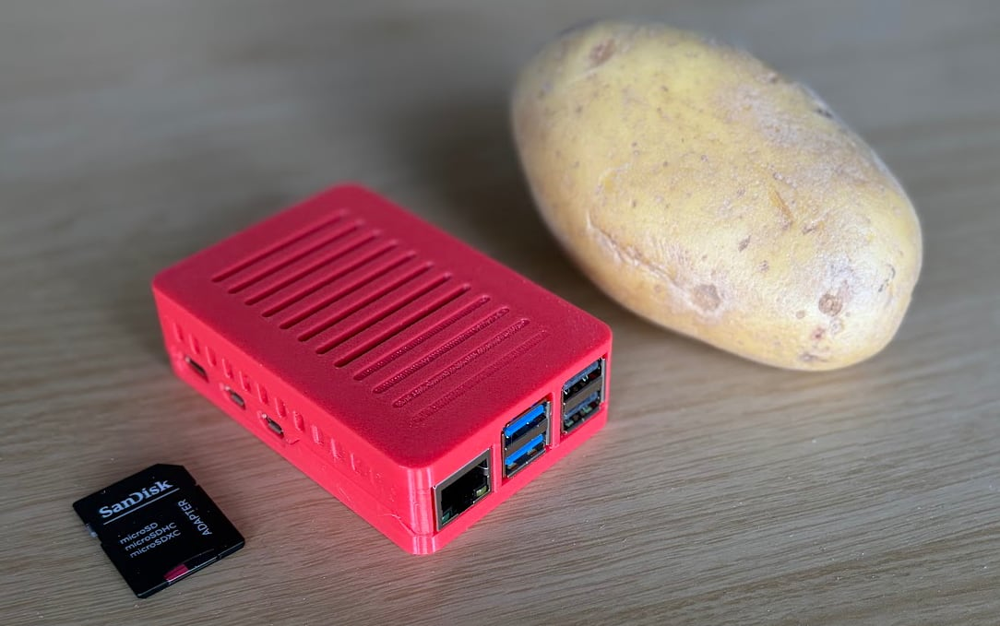

# Potato OS

[](LICENSE)

Experimental Raspberry Pi 5 Linux mod with optimised local LLM inference. Runs quantised models on-device with a browser chat UI — no cloud, no GPU, just a Pi.



*Potato sold separately.*

**Hardware:** Raspberry Pi 5 (8GB / 16GB) | **Runtime:** [ik_llama.cpp](https://github.com/ikawrakow/ik_llama.cpp) (IQK-optimised) + upstream [llama.cpp](https://github.com/ggerganov/llama.cpp) | **Default model:** Qwen3.5-2B

## Install (recommended)

1. Download the latest SD card image from [Releases](https://github.com/slomin/potato-os/releases)
2. Flash it to a microSD card with [Raspberry Pi Imager](https://www.raspberrypi.com/software/)
3. Insert the card, power on the Pi, and wait for first boot to complete
4. Open `http://potato.local` in a browser

A starter model (~1.8 GB) downloads automatically on first boot. Chat is ready once the download finishes and the status shows CONNECTED.

See [Flashing Guide](docs/flashing.md) for detailed step-by-step instructions, including how to flash directly from Raspberry Pi Imager without a manual download.

### What you need

- Raspberry Pi 5 (8 GB or 16 GB)
- microSD card (16 GB minimum)
- Power supply (20W USB-C minimum, 27W recommended if using a USB SSD)
- Ethernet or Wi-Fi connection (for first-boot model download)

## MVP status

Potato OS is an early release meant for testing and tinkering, not production use.

### What works

- Chat with streaming responses
- Vision — attach a photo and ask about it
- Multi-chat sessions (persisted in your browser)
- Model management — download by URL, upload, delete, switch active model
- System monitoring — CPU, GPU, temperature, memory, storage, power draw
- Dual inference runtime — ik_llama (default) and upstream llama.cpp

Updates are reflash-only for now — there is no OTA or in-place upgrade path yet.

## Recovery and rollback

Need to back out or recover from a failed setup? See [docs/recovery.md](docs/recovery.md) for the practical rollback paths for:

- restoring a previous Raspberry Pi OS or other system image
- reflashing to a newer Potato OS image

---

## Development

Everything below is for contributors and developers.

### Local dev

```bash
uv sync
POTATO_ENABLE_ORCHESTRATOR=0 uv run uvicorn app.main:app --host 0.0.0.0 --port 1983
```

### Tests

```bash
uv run python -m pytest tests/unit tests/api -q -n auto
npx playwright test --reporter=dot --timeout=15000 --workers=3
```

### Building llama runtimes

Runtimes are built on the Pi (aarch64, no cross-compilation). From your Mac:

```bash
# Build both ik_llama + llama_cpp from latest source on Pi, sync back
./bin/build_and_publish_remote.sh

# Build + publish to GitHub Releases
./bin/build_and_publish_remote.sh --publish

# Just one family
./bin/build_and_publish_remote.sh --family ik_llama
```

This SSHs to `potato.local` (default: `pi`/`raspberry`), clones latest source, builds, and syncs the binaries back. Use `--publish` to upload tarballs to GitHub Releases.

Or build directly on the Pi:

```bash
./bin/build_llama_runtime.sh --family both --fetch --clean
```

Published runtimes are available at [GitHub Releases](https://github.com/slomin/potato-os/releases). Fresh installs auto-download when no local build is present:

```bash
POTATO_LLAMA_RELEASE_AUTO=1 ./bin/install_dev.sh
```

### SD card images

Build a flashable Potato OS image from macOS:

```bash
./bin/build_local_image.sh --setup-docker
```

See [Building Images](docs/building-images.md) for prerequisites, variants, flashing, and publishing releases.

### Project

- Board: [github.com/users/slomin/projects/8](https://github.com/users/slomin/projects/8)
- Defaults: hostname `potato`, SSH `pi`/`raspberry`

## License

Apache License 2.0. See [LICENSE](LICENSE) for details.
