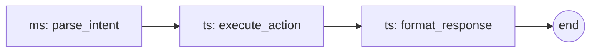

# Permitato — RIG Workflow

> **Manifest:** `app.json` · **RIG version:** 0.3

`app.json` defines the app's identity and process configuration — id, entry point, socket, whether it needs LLM access (`inferno`), and restart behavior (`critical`).

`rig.md` defines the app's cognitive workflow — the steps it runs, how they chain, and the data contracts between them. Together they form the complete app contract.

## Workflow Overview

Permitato is a conversational attention guard. The user sends a message (mode switch, unblock request, or general chat). The LLM interprets the message and includes an action marker in its response. The backend extracts the marker, executes the action against Pi-hole, and streams the cleaned response to the user.

## Step Catalog

| step_id | type | description | input | output | next |
|---------|------|-------------|-------|--------|------|
| parse_intent | ms | LLM interprets user message with system prompt containing current mode/exceptions state | `{"message": "...", "history": [...]}` | `{"response": "...", "action_marker": "[ACTION:...]"}` | execute_action |
| execute_action | ts | Extract action marker, call Pi-hole adapter for mode switch or exception grant/deny | `{"text": "...", "intent": {...}}` | `{"action_result": {...}}` | format_response |
| format_response | ts | Strip action markers from LLM text, append action result as final SSE event | `{"text": "...", "action_result": {...}}` | `{"display_text": "...", "permitato_action": {...}}` | *(terminal)* |

**Type key:** `ts` = Tool Step (deterministic code), `ms` = Model Step (LLM inference).

## Flow Graph



## Step Envelope Contract

Every step returns a JSON envelope with this shape:

```json
{
  "step_id": "execute_action",
  "type": "ts",
  "result": {"type": "mode_switched", "mode": "work"},
  "next": {"mode": "direct", "step_id": "format_response", "args": {}}
}
```

### Fields

| field | type | required | description |
|-------|------|----------|-------------|
| `step_id` | string | yes | Which step just ran |
| `type` | string | yes | `"ms"` or `"ts"` |
| `result` | object | yes | Step-specific output payload |
| `next` | object or null | yes | What to run next (`null` = terminal) |

### `next` variants

**Direct — chain to another step:**

```json
{"mode": "direct", "step_id": "execute_action", "args": {}}
```

**Model — invoke LLM for next decision:**

```json
{"mode": "model", "prompt_id": "parse_intent", "inputs": {"message": "..."}}
```

**Terminal — workflow complete:**

```json
null
```

## Schema References

| step_id | key schemas |
|---------|-------------|
| parse_intent | system_prompt.py (prompt template), modes.py (state context) |
| execute_action | intent.py (ParsedIntent), pihole_adapter.py (Pi-hole API calls) |
| format_response | intent.py (strip_action_markers) |
