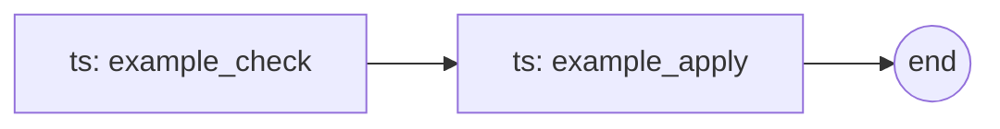

# {App Name} — RIG Workflow

> **Manifest:** `app.json` · **RIG version:** 0.3

`app.json` defines the app's identity and process configuration — id, entry point, socket, whether it needs LLM access (`inferno`), and restart behavior (`critical`).

`rig.md` defines the app's cognitive workflow — the steps it runs, how they chain, and the data contracts between them. Together they form the complete app contract.

Apps with `inferno: true` in `app.json` use Model Steps (LLM inference). Apps without LLM access use only Tool Steps (deterministic code).

## Workflow Overview

<!-- 2-3 sentences: what the app does, what the typical user interaction looks like,
     and how Model Steps and Tool Steps collaborate to fulfill it. -->

## Step Catalog

| step_id | type | description | input | output | next |
|---------|------|-------------|-------|--------|------|
| example_check | ts | Run a deterministic check against external state | `{"query": "..."}` | `{"status": "ok"}` | example_apply |
| example_apply | ts | Apply a change based on the check result | `{"status": "..."}` | `{"applied": true}` | *(terminal)* |

**Type key:** `ts` = Tool Step (deterministic code), `ms` = Model Step (LLM inference).
Apps with `inferno: true` add `ms` rows here for steps that require the model.

## Flow Graph



## Step Envelope Contract

Every step returns a JSON envelope with this shape:

```json
{
  "step_id": "example_check",
  "type": "ts",
  "result": {"status": "ok"},
  "next": {"mode": "direct", "step_id": "example_respond", "args": {}}
}
```

### Fields

| field | type | required | description |
|-------|------|----------|-------------|
| `step_id` | string | yes | Which step just ran |
| `type` | string | yes | `"ms"` or `"ts"` |
| `result` | object | yes | Step-specific output payload |
| `next` | object or null | yes | What to run next (`null` = terminal) |

### `next` variants

**Direct — chain to another step:**

```json
{"mode": "direct", "step_id": "apply_mode", "args": {}}
```

**Model — invoke LLM for next decision:**

```json
{"mode": "model", "prompt_id": "rank_options", "inputs": {}}
```

**Terminal — workflow complete:**

```json
null
```

## Schema References

<!-- Per-step input/output schemas. Can be inline JSON examples (as in the Step Catalog
     above) or paths to dedicated schema files as the app grows:

     | step_id | input schema | output schema |
     |---------|-------------|---------------|
     | parse_intent | schemas/parse_intent_in.json | schemas/parse_intent_out.json |
-->
