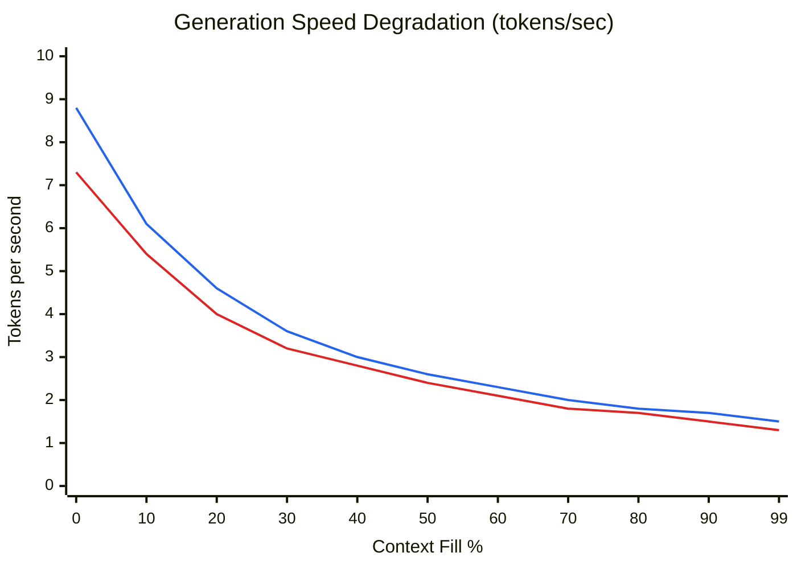
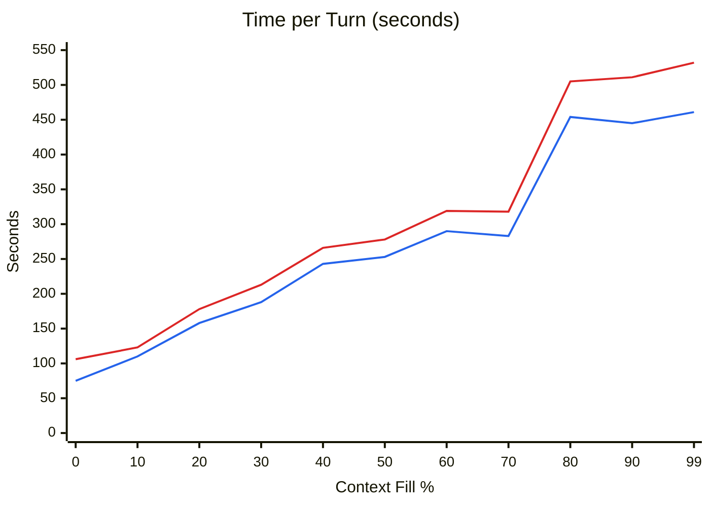

# Context Window 48K Benchmark Results

Overnight sweep for ticket #168, round 2. Testing 49152-token (48K) context on both Pi 5 variants.

## Test Configuration

| Parameter | Value |
|-----------|-------|
| Model | `Qwen3-30B-A3B-Instruct-2507-Q3_K_S-2.66bpw.gguf` (9.5 GB) |
| Runtime | ik_llama.cpp (Pi 5 optimized build) |
| Context window | 49,152 tokens (48K) |
| KV cache | q8_0 / q8_0 — 2,448 MiB total (1,224 MiB K + 1,224 MiB V) |
| Flash attention | on |
| Cache RAM | 1,024 MiB (prompt cache in host RAM) |
| Parallel slots | 1 |
| Threads | 4 (all Pi 5 cores) |
| Sampling | temperature=0, seed=42, max_tokens=1024, cache_prompt=true |
| Conversation | Multi-turn storytelling, ~100 tok user / ~700 tok assistant per turn |
| Date | 2026-03-26 |

### Hardware

| | Pi 5 16 GB | Pi 5 8 GB + SSD |
|---|-----------|---------------|
| Hostname | `potato.local` | `ssd.local` |
| RAM | 16,218 MiB | 8,062 MiB |
| Storage | 128 GB SD card | 128 GB NVMe SSD |
| Swap | 2 GB zram (zstd) | 2 GB zram (zstd) |

## Results Summary

Both hardware configurations filled the 48K context window to 99.4% (48,846/49,152 tokens) before context shift at turn 71.

| Metric | Pi 5 16 GB | Pi 5 8 GB + SSD |
|--------|-----------|-----------------|
| Turns completed | 71 | 71 |
| Total runtime | 5h 22m | 5h 58m |
| Max context fill | 99.4% | 99.4% |
| Gen speed (empty) | 8.8 t/s | 7.3 t/s |
| Gen speed (full) | 1.5 t/s | 1.3 t/s |
| Speed degradation | -83% | -82% |
| Peak swap | 0 MB | 2,047 MB |
| Temperature range | 57–63°C | 71–76°C |
| Stability | Zero swap, rock solid | Survived on zram swap |

## Generation Speed vs Context Fill

> Blue: Pi 5 16 GB — Red: Pi 5 8 GB + SSD

## Time per Turn vs Context Fill

> Blue: Pi 5 16 GB — Red: Pi 5 8 GB + SSD

## Detailed Data (10 evenly-spaced samples)

### Pi 5 16 GB

| Turn | Fill % | n_past | Gen t/s | PP t/s | TTFT | Total | RSS | Avail | Temp |
|------|--------|--------|---------|--------|------|-------|-----|-------|------|
| 1 | 1.5% | 728 | 8.8 | 29.1 | 3.4s | 75s | 12,254 MB | 13,038 MB | 61°C |
| 9 | 13.0% | 6,379 | 5.6 | 11.7 | 3.2s | 102s | 12,269 MB | 13,030 MB | 63°C |
| 18 | 25.9% | 12,729 | 4.0 | 7.7 | 4.3s | 187s | 12,282 MB | 12,997 MB | 60°C |
| 27 | 38.5% | 18,913 | 3.1 | 5.9 | 5.8s | 215s | 12,291 MB | 12,998 MB | 60°C |
| 36 | 51.3% | 25,197 | 2.6 | 4.6 | 7.3s | 325s | 12,305 MB | 12,992 MB | 59°C |
| 44 | 62.3% | 30,645 | 2.2 | 4.4 | 15.1s | 334s | 12,314 MB | 12,932 MB | 59°C |
| 53 | 75.0% | 36,877 | 1.9 | 3.1 | 11.2s | 302s | 12,326 MB | 12,957 MB | 60°C |
| 62 | 88.0% | 43,259 | 1.7 | 2.6 | 16.1s | 391s | 12,336 MB | 12,942 MB | 60°C |
| 70 | 99.4% | 48,846 | 1.5 | 2.6 | 13.9s | 461s | 12,348 MB | 12,949 MB | 59°C |
| 71 | — | shift | 1.5 | 2.4 | 20.8s | 712s | 12,415 MB | 12,875 MB | 58°C |

### Pi 5 8 GB + SSD

| Turn | Fill % | n_past | Gen t/s | PP t/s | TTFT | Total | RSS | Avail | Swap | Zram | Temp |
|------|--------|--------|---------|--------|------|-------|-----|-------|------|------|------|
| 1 | 1.5% | 728 | 7.3 | 5.3 | 18.9s | 106s | 6,994 MB | 6,637 MB | 2,047 MB | 485 MB | 73°C |
| 9 | 13.0% | 6,379 | 4.9 | 10.3 | 3.6s | 115s | 7,181 MB | 6,629 MB | 2,047 MB | 449 MB | 75°C |
| 18 | 25.9% | 12,729 | 3.6 | 6.4 | 5.1s | 206s | 7,288 MB | 6,616 MB | 2,042 MB | 453 MB | 74°C |
| 27 | 38.5% | 18,913 | 2.9 | 5.0 | 6.9s | 235s | 7,230 MB | 6,576 MB | 2,035 MB | 488 MB | 75°C |
| 36 | 51.3% | 25,197 | 2.3 | 3.7 | 9.3s | 357s | 7,167 MB | 6,272 MB | 1,776 MB | 533 MB | 73°C |
| 44 | 62.3% | 30,645 | 2.0 | 3.9 | 17.0s | 368s | 7,122 MB | 6,021 MB | 1,515 MB | 539 MB | 74°C |
| 53 | 75.0% | 36,877 | 1.7 | 2.4 | 14.4s | 335s | 7,150 MB | 5,712 MB | 1,236 MB | 561 MB | 72°C |
| 62 | 88.0% | 43,259 | 1.5 | 1.9 | 21.7s | 442s | 7,105 MB | 5,354 MB | 936 MB | 574 MB | 73°C |
| 70 | 99.4% | 48,846 | 1.3 | 1.8 | 20.5s | 532s | 7,088 MB | 5,086 MB | 666 MB | 578 MB | 72°C |
| 71 | — | shift | 1.4 | 1.7 | 30.2s | 773s | 6,815 MB | 4,996 MB | 610 MB | 536 MB | 71°C |

## Key Observations

### Speed degradation is linear, not cliff-based
Generation speed follows a smooth, nearly linear decline from empty to full context. There is no sudden performance cliff. At 50% fill, speed is already ~70% degraded. At 99% fill, speed is ~83% degraded. This pattern is consistent across both hardware configurations.

### The 8 GB Pi survives 48K on zram alone
The 8 GB Pi successfully completed the entire 48K context sweep without OOM or crash. Zram compression peaked at ~595 MB compressed (holding ~2 GB of original data), giving an effective 3.4:1 compression ratio. Swap usage actually *decreased* over the run (2,047 MB → 666 MB) as the OS settled memory pages into the KV cache working set.

### 16 GB Pi has massive headroom
The 16 GB Pi never touched swap. Available memory stayed above 12.8 GB throughout, meaning it could theoretically handle even larger context windows. RSS grew only 94 MB over 70 turns (12,254 → 12,348 MB).

### Temperature differential
The 8 GB Pi runs 12–15°C hotter (72–76°C vs 58–63°C), likely due to continuous zram compression/decompression overhead. Both stayed well below thermal throttle (85°C).

### Cold-start penalty on 8 GB
Turn 1 on the 8 GB Pi shows an 18.9s TTFT (vs 3.4s on 16 GB) due to initial mmap page faults pulling model weights from SSD into RAM. After turn 1, TTFT converges to similar ranges on both platforms.

### Context shift behavior
Both Pis hit context shift at exactly the same point (turn 71, n_past 48,846 → 25,346). The shift turn took significantly longer (712s on 16 GB, 773s on 8 GB) as the server reprocessed the truncated context.

## Raw Data

Full turn-by-turn data: [`context_window_48k_raw.txt`](context_window_48k_raw.txt)

JSONL source files:
- `output/benchmarks/ctx_window_48k_pi5-16gb.jsonl`
- `output/benchmarks/ctx_window_48k_pi5-8gb-ssd.jsonl`
