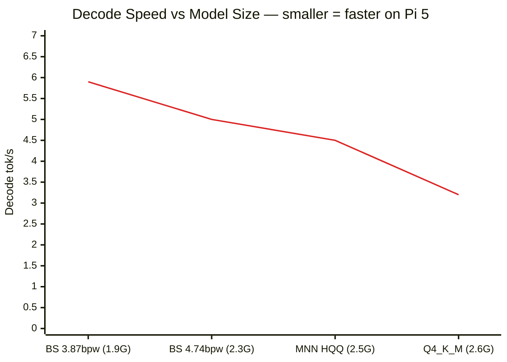
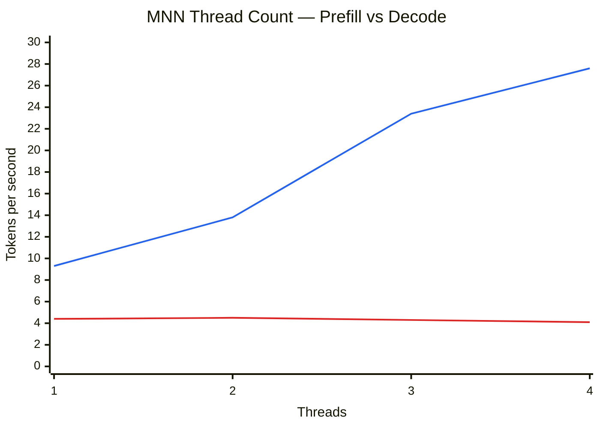
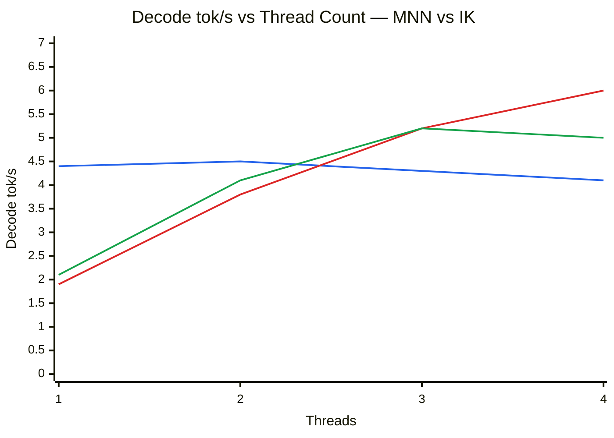

# MNN Spike Results — Qwen3.5-4B on Raspberry Pi 5

Refs #24

## Test configuration

| | Value |
|---|---|
| Date | 2026-03-26 |
| Hardware | Raspberry Pi 5, 16GB LPDDR4X, BCM2712 |
| CPU | 4× Cortex-A76 @ 2.4GHz (ARMv8.2-A: sdot, fp16; no i8mm, sve2, sme2) |
| MNN version | 3.4.1 (commit 6b1db4c) |
| IK runtime | ik_llama (installed at /opt/potato/llama/) |
| MNN model | taobao-mnn/Qwen3.5-4B-MNN (4-bit HQQ, quant_block=64, embed/act=fp16) |
| IK model 1 | [unsloth/Qwen3.5-4B-GGUF](https://huggingface.co/unsloth/Qwen3.5-4B-GGUF) Q4_K_M (2.6GB) — standard llama.cpp K-quant |
| IK model 2 | ByteShape Qwen3-4B-Instruct-2507-Q5_K_S-4.74bpw.gguf (2.3GB) |
| IK model 3 | ByteShape Qwen3-4B-Instruct-2507-Q4_K_S-3.87bpw.gguf (1.9GB) |
| Prompt | "Explain how a lighthouse lamp works in about 100 words." |
| Max tokens | 128 |
| Thinking mode | Disabled on all runtimes |
| CPU governor | Performance (2.4GHz locked) |
| Memory state | Clean — no other inference processes running |

**Note on ByteShape quants**: ByteShape uses [ShapeLearn](https://byteshape.com), a gradient-based per-tensor precision optimizer. The K-quant labels (Q4_K_S, Q5_K_S) are used purely for HuggingFace compatibility — they do not correspond to standard llama.cpp quantization profiles. The **bpw** (bits per weight) suffix in the filename is the actual meaningful metric. A ByteShape "Q4_K_S" at 3.87 bpw is a fundamentally different quantization from a standard llama.cpp Q4_K_S.

## Build experience

MNN compiled cleanly on Pi 5 with `cmake` + `g++` 14.2.0.

| Metric | Value |
|---|---|
| Build time | 6m 33s (`-j4`) |
| `llm_demo` binary | 76 KB (dynamically linked to libMNN) |
| Build issues | None — clean first-try build |
| Model load time | 5.6s + 1.9s tuning = 7.5s total |

## Results summary

### Decode throughput (the metric that matters for user experience)

| Runtime | Model | Model size | Decode tok/s | Prefill tok/s | RSS |
|---------|-------|-----------|-------------|--------------|-----|
| MNN (4 threads) | Qwen3.5-4B-MNN (4bit HQQ) | 2.5 GB | 4.1 | **27.6** | 3.0 GB |
| MNN (2 threads, best decode) | Qwen3.5-4B-MNN (4bit HQQ) | 2.5 GB | 4.5 | 13.8 | 3.0 GB |
| IK llama (4 threads) | Qwen3.5-4B-Q4_K_M | 2.6 GB | 3.2 | ~11 | 2.8 GB |
| IK llama (4 threads) | ByteShape Qwen3-4B Q5_K_S (4.74 bpw) | 2.3 GB | 5.0 | ~5* | 2.7 GB |
| IK llama (4 threads) | ByteShape Qwen3-4B Q4_K_S (3.87 bpw) | 1.9 GB | **5.9** | ~6* | 2.2 GB |

*IK prefill numbers are noisy due to prompt caching on first request. Steady-state shown.

#### Decode speed comparison

```mermaid
---
config:
    themeVariables:
        xyChart:
            plotColorPalette: "#8b5cf6, #a78bfa, #2563eb, #f97316, #ef4444"
---
xychart-beta
    title "Decode Speed (tok/s, higher is better)"
    x-axis ["MNN 4t HQQ", "MNN 2t HQQ", "IK Q4_K_M", "IK BS 4.74bpw", "IK BS 3.87bpw"]
    y-axis "Tokens per second" 0.5 --> 7
    bar [4.1, 0.01, 0.01, 0.01, 0.01]
    bar [0.01, 4.5, 0.01, 0.01, 0.01]
    bar [0.01, 0.01, 3.2, 0.01, 0.01]
    bar [0.01, 0.01, 0.01, 5.0, 0.01]
    bar [0.01, 0.01, 0.01, 0.01, 5.9]
```

All results on same hardware (Pi 5 16GB).

#### Model size vs decode speed

On Pi 5's bandwidth-constrained 32-bit bus, model size is the dominant factor — runtime choice is secondary.

#### Prefill speed comparison

```mermaid
---
config:
    themeVariables:
        xyChart:
            plotColorPalette: "#8b5cf6, #a78bfa, #2563eb, #f97316, #ef4444"
---
xychart-beta
    title "Prefill Speed (tok/s, higher is better)"
    x-axis ["MNN 4t HQQ", "MNN 2t HQQ", "IK Q4_K_M", "IK BS 4.74bpw", "IK BS 3.87bpw"]
    y-axis "Tokens per second" 0.5 --> 30
    bar [27.6, 0.01, 0.01, 0.01, 0.01]
    bar [0.01, 13.8, 0.01, 0.01, 0.01]
    bar [0.01, 0.01, 11.0, 0.01, 0.01]
    bar [0.01, 0.01, 0.01, 5.0, 0.01]
    bar [0.01, 0.01, 0.01, 0.01, 6.0]
```

MNN dominates prefill (compute-bound) but loses decode (memory-bandwidth-bound).

#### Best prefill: MNN vs IK (size-matched models)

| Runtime | Model | Model size | Prefill tok/s |
|---------|-------|-----------|--------------|
| **MNN (4 threads)** | Qwen3.5-4B-MNN (HQQ 4bit) | 2.5 GB | **27.6** |
| IK llama (4 threads) | Qwen3.5-4B Q4_K_M (unsloth) | 2.6 GB | ~11 |
| IK llama (4 threads) | ByteShape Qwen3-4B Q5_K_S (4.74 bpw) | 2.3 GB | ~5 |

At comparable model sizes (~2.3-2.6 GB), MNN's prefill is **2.5-5x faster** than IK llama. This is MNN's clear strength — its fused transformer ops and ARM82 compute kernels excel at the matrix-matrix multiplications that dominate prefill. The advantage is less useful in practice since prefill only runs once per conversation turn.

### MNN thread count sweep (Qwen3.5-4B-MNN, memory=low, precision=low)

| Threads | Prefill tok/s | Decode tok/s |
|---------|--------------|-------------|
| 4 | 27.6 | 4.1 |
| 3 | 23.4 | 4.3 |
| 2 | 13.8 | **4.5** |
| 1 | 9.3 | 4.4 |

Decode improves with fewer threads (less bus contention), peaks at 2 threads (+11% over baseline).
Prefill scales linearly with threads (compute-bound).

Blue: **prefill** (scales linearly with threads) — Red: **decode** (peaks at 2 threads, bus-contention-limited)

### IK llama thread count sweep

#### ByteShape Qwen3-4B Q4_K_S (3.87 bpw, 1.9 GB)

| Threads | Prefill tok/s | Decode tok/s |
|---------|--------------|-------------|
| 4 | ~5.4 | **6.0** |
| 3 | ~5.1 | 5.2 |
| 2 | ~3.8 | 3.8 |
| 1 | ~1.9 | 1.9 |

#### ByteShape Qwen3-4B Q5_K_S (4.74 bpw, 2.3 GB)

| Threads | Prefill tok/s | Decode tok/s |
|---------|--------------|-------------|
| 4 | ~4.8 | 5.0 |
| 3 | ~5.0 | **5.2** |
| 2 | ~4.1 | 4.1 |
| 1 | ~2.1 | 2.1 |

IK llama shows the opposite pattern from MNN — **more threads = faster decode**. IK's GEMV parallelizes efficiently across threads without hitting the bus contention that hurts MNN. Best decode at 4 threads for the smaller model, 3 threads for the larger.

Blue: MNN Qwen3.5-4B HQQ 4bit — Red: IK BS Q4_K_S 3.87bpw — Green: IK BS Q5_K_S 4.74bpw. MNN's decode is flat across threads (bus-contention-limited). IK scales linearly — its GEMV implementation handles multi-threading better.

### MNN config sweep (2 threads)

| Config | Decode tok/s | Notes |
|--------|-------------|-------|
| precision=low, memory=low | **4.5** | Best — 4-bit weights, on-the-fly dequant |
| precision=normal, memory=low | 4.5 | No difference |
| precision=high, memory=low | 4.4 | No difference |
| precision=low, memory=normal | **0.65** | Terrible — pre-dequant to fp32, kills bandwidth |

## Why MNN decode is slow on Pi 5

LLM decode is memory-bandwidth-bound (streaming entire model per token). Three factors compound:

1. **32-bit memory bus**: Pi 5's BCM2712 has a 32-bit LPDDR4X interface. Effective bandwidth ~4.8-5.7 GB/s (tinymembench). With a 2.5GB model, theoretical max is ~2 tok/s. Getting 4 tok/s means caching helps, but we're near the ceiling.

2. **No i8mm instructions**: Pi 5 (ARMv8.2) uses sdot (1 result/cycle). Snapdragon 8 Gen 2 (ARMv9) uses smmla/i8mm (2 results/cycle). This means fewer useful FLOPs per byte loaded.

3. **Thread contention**: 4 threads fighting over one 32-bit bus. MNN's own research found fewer threads can be faster for decode.

For reference, the same MNN model on Snapdragon 8 Gen 2 (LPDDR5X, 64-bit bus, ~17 GB/s, i8mm): **42.5 tok/s prefill, 12.2 tok/s decode** — 3x faster decode, matching the ~3x bandwidth gap.

## Cross-device comparison (MNN Qwen3.5-4B-MNN, CPU only)

| Device | Prefill tok/s | Decode tok/s | Memory | Memory bus | Effective BW |
|--------|--------------|-------------|--------|------------|-------------|
| Snapdragon 8 Gen 2 (OnePlus 12R) | 42.5 | 12.2 | 3.7 GB | 64-bit LPDDR5X | ~15-20 GB/s |
| **Pi 5 (BCM2712)** | **27.6** | **4.1** | **3.0 GB** | **32-bit LPDDR4X** | **~4.8-5.7 GB/s** |

Snapdragon numbers from MNN Android app benchmark (MnnLlmChat v0.8.0.1, `nPromptGen=128/128`, 3 repeats, CPU backend, low precision, low memory). Pi numbers from `llm_demo` benchmark mode with a ~33 token prompt and 128 max decode tokens. Decode comparison is valid — decode speed is independent of prompt length.

```mermaid
---
config:
    themeVariables:
        xyChart:
            plotColorPalette: "#2563eb, #93c5fd, #f97316, #fdba74"
---
xychart-beta
    title "MNN Cross-Device: Pi 5 vs Snapdragon 8 Gen 2"
    x-axis ["Pi5 Prefill", "Pi5 Decode", "SD8G2 Prefill", "SD8G2 Decode"]
    y-axis "Tokens per second" 0.5 --> 45
    bar [27.6, 0.01, 0.01, 0.01]
    bar [0.01, 4.1, 0.01, 0.01]
    bar [0.01, 0.01, 42.5, 0.01]
    bar [0.01, 0.01, 0.01, 12.2]
```

Blue: Pi 5 (32-bit LPDDR4X, ~5 GB/s) — Orange: Snapdragon 8 Gen 2 (64-bit LPDDR5X, ~17 GB/s). Prefill gap is modest (1.5x — compute-bound, both CPUs are capable). Decode gap is 3x — directly tracks the ~3x effective memory bandwidth difference, since decode streams the entire model per token.

## Qualitative assessment

| Capability | MNN | IK llama | Winner |
|------------|-----|----------|--------|
| Decode throughput (same model class) | 4.1-4.5 tok/s | 3.2-5.9 tok/s | **IK** (smaller GGUF = faster) |
| Prefill throughput | **27.6 tok/s** | ~6-11 tok/s | **MNN** (2-4x faster) |
| HTTP server / API | `mls serve` (optional, not tested) | OpenAI-compatible SSE | **IK** (proven) |
| Prompt caching | Within session only | Persistent across requests | **IK** |
| Multi-turn chat | Single session | Full API support | **IK** |
| Vision/multimodal | Possible (extra build flags) | Yes (mmproj) | **IK** |
| Model ecosystem | ~208 pre-converted | Thousands of GGUF | **IK** |
| Documentation | Primarily Chinese | English-first, extensive | **IK** |
| Build experience | Clean, 6.5 min | Already deployed | **IK** |
| Quantization flexibility | Fixed at export time | Many GGUF quant options | **IK** |

## Caveats

1. **Output quality was not evaluated.** This spike measured throughput only. The MNN HQQ 4-bit quant, GGUF Q4_K_M, and ByteShape Q4_K_S/Q5_K_S may produce different quality outputs at the same bit-width. A dedicated quality evaluation would be needed to assess tradeoffs.

2. **No ByteShape-style quants exist for Qwen3.5 yet.** The ByteShape GGUF models used here are Qwen3 (not Qwen3.5), so the IK comparison crosses model generations. A same-model comparison would require either a ByteShape Qwen3.5-4B GGUF or an MNN-converted Qwen3-4B — neither was available at time of testing.

## Recommendation: pursue as a complementary runtime for prefill-bound tasks

**MNN is worth integrating into Potato OS as a sidecar runtime, specifically for prefill-heavy workloads.**

### Reasoning

1. **MNN's prefill advantage is real and large.** At 27.6 tok/s vs ~5-11 tok/s for IK llama on size-matched models, MNN delivers 2.5-5x faster prompt processing. This matters for summarization, RAG context ingestion, long-document processing, code analysis, and any task where the input is much larger than the output.

2. **Decode is not MNN's strength on Pi 5**, but that's OK. For interactive chat (where decode dominates the experience), IK llama with ByteShape Q4_K_S (3.87 bpw) at 5.9 tok/s is the better choice. The two runtimes have complementary strengths — use MNN for prefill-heavy tasks, IK for decode-heavy chat.

3. **The build and runtime experience is solid.** MNN compiled cleanly on Pi 5 in 6.5 minutes, the pre-converted model worked out of the box, and the `llm_demo` benchmark mode is well-designed. This is a production-grade framework, not a research prototype.

4. **Integration cost is real but manageable.** MNN ships an optional `mls serve` binary with chat-completion endpoints (not tested in this spike). No prompt caching across requests. But for batch/prefill tasks, these gaps matter less than for interactive chat. A sidecar approach (MNN for specific tasks, IK for general chat) avoids rearchitecting the existing llama-server integration.

5. **The Pi 5's 32-bit memory bus is the decode bottleneck**, not MNN. No runtime can fix this for decode. But prefill is compute-bound and MNN's fused transformer ops + ARM82 kernels extract more from the available compute than IK does.

### Action items

- Follow up with an MNN sidecar integration ticket — lightweight HTTP wrapper around `llm_demo` for prefill-heavy API endpoints
- Keep IK llama as the primary runtime for interactive chat
- Consider ByteShape Qwen3-4B-Instruct-2507 Q4_K_S (3.87 bpw) as a potential default model for IK — 5.9 tok/s decode in 1.9GB is compelling
- Test MNN's `mls serve` HTTP server (`BUILD_MLS=ON`) as the integration path — may avoid needing a custom wrapper
