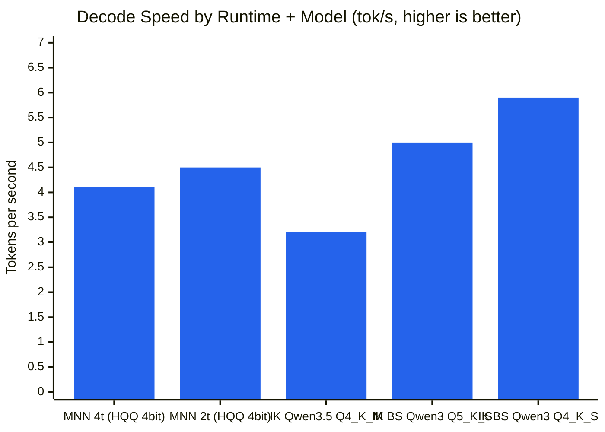
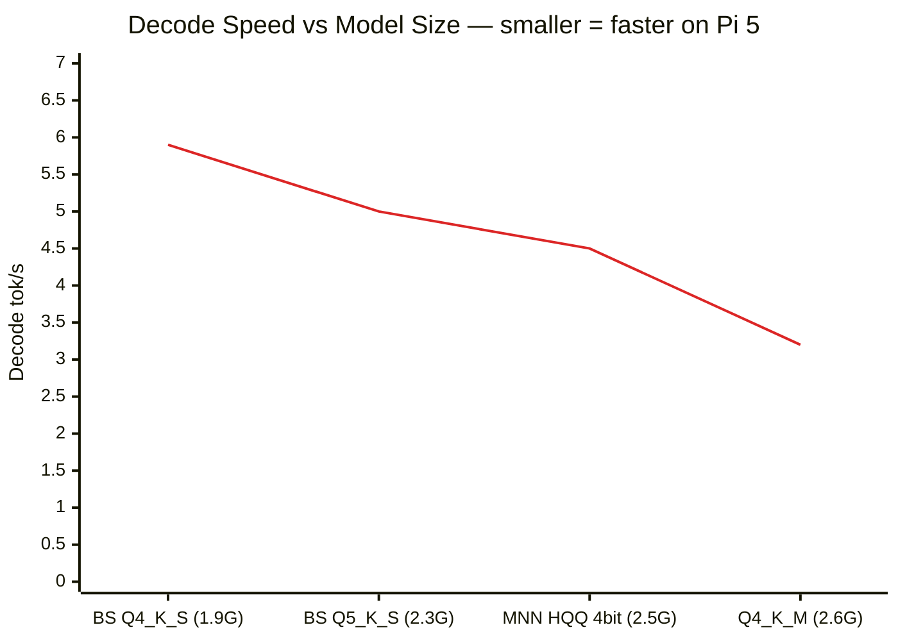
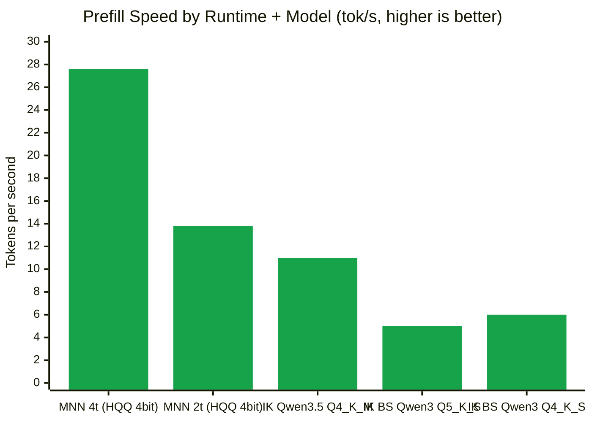
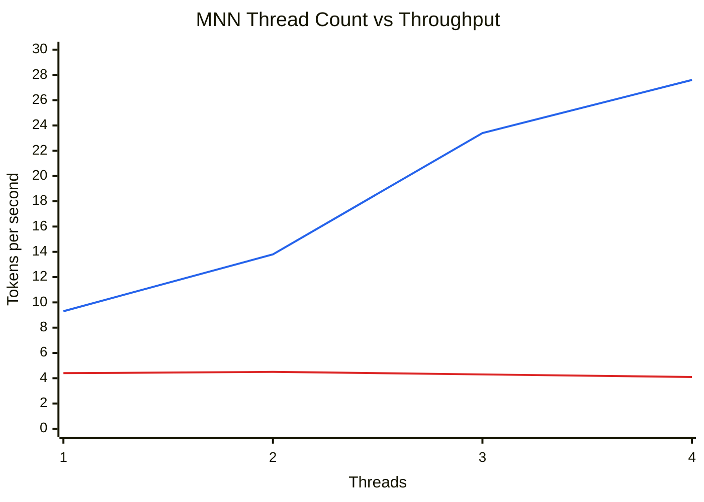

# MNN Spike Results — Qwen3.5-4B on Raspberry Pi 5

Refs #24

## Test configuration

| | Value |
|---|---|
| Date | 2026-03-26 |
| Hardware | Raspberry Pi 5, 16GB LPDDR4X, BCM2712 |
| CPU | 4× Cortex-A76 @ 2.4GHz (ARMv8.2-A: sdot, fp16; no i8mm, sve2, sme2) |
| MNN version | 3.4.1 (commit 6b1db4c) |
| IK runtime | ik_llama (installed at /opt/potato/llama/) |
| MNN model | taobao-mnn/Qwen3.5-4B-MNN (4-bit HQQ, quant_block=64, embed/act=fp16) |
| IK model 1 | Qwen3.5-4B-Q4_K_M.gguf (2.6GB) |
| IK model 2 | ByteShape Qwen3-4B-Instruct-2507-Q5_K_S-4.74bpw.gguf (2.3GB) |
| IK model 3 | ByteShape Qwen3-4B-Instruct-2507-Q4_K_S-3.87bpw.gguf (1.9GB) |
| Prompt | "Explain how a lighthouse lamp works in about 100 words." |
| Max tokens | 128 |
| Thinking mode | Disabled on all runtimes |
| CPU governor | Performance (2.4GHz locked) |
| Memory state | Clean — no other inference processes running |

## Build experience

MNN compiled cleanly on Pi 5 with `cmake` + `g++` 14.2.0.

| Metric | Value |
|---|---|
| Build time | 6m 33s (`-j4`) |
| `llm_demo` binary | 76 KB (dynamically linked to libMNN) |
| Build issues | None — clean first-try build |
| Model load time | 5.6s + 1.9s tuning = 7.5s total |

## Results summary

### Decode throughput (the metric that matters for user experience)

| Runtime | Model | Model size | Decode tok/s | Prefill tok/s | RSS |
|---------|-------|-----------|-------------|--------------|-----|
| MNN (4 threads) | Qwen3.5-4B-MNN (4bit HQQ) | 2.5 GB | 4.1 | **27.6** | 3.0 GB |
| MNN (2 threads, best decode) | Qwen3.5-4B-MNN (4bit HQQ) | 2.5 GB | 4.5 | 13.8 | 3.0 GB |
| IK llama (4 threads) | Qwen3.5-4B-Q4_K_M | 2.6 GB | 3.2 | ~11 | 2.8 GB |
| IK llama (4 threads) | ByteShape Qwen3-4B-Q5_K_S (4.74 bpw) | 2.3 GB | 5.0 | ~5* | 2.7 GB |
| IK llama (4 threads) | ByteShape Qwen3-4B-Q4_K_S (3.87 bpw) | 1.9 GB | **5.9** | ~6* | 2.2 GB |

*IK prefill numbers are noisy due to prompt caching on first request. Steady-state shown.

#### Decode speed comparison

BS = ByteShape

#### Model size vs decode speed

On Pi 5's bandwidth-constrained 32-bit bus, model size is the dominant factor — runtime choice is secondary.

#### Prefill speed comparison

MNN dominates prefill (compute-bound) but loses decode (memory-bandwidth-bound).

### MNN thread count sweep (Qwen3.5-4B-MNN, memory=low, precision=low)

| Threads | Prefill tok/s | Decode tok/s |
|---------|--------------|-------------|
| 4 | 27.6 | 4.1 |
| 3 | 23.4 | 4.3 |
| 2 | 13.8 | **4.5** |
| 1 | 9.3 | 4.4 |

Decode improves with fewer threads (less bus contention), peaks at 2 threads (+11% over baseline).
Prefill scales linearly with threads (compute-bound).

Blue: prefill (scales with threads) — Red: decode (peaks at 2 threads, bus-contention-limited)

### MNN config sweep (2 threads)

| Config | Decode tok/s | Notes |
|--------|-------------|-------|
| precision=low, memory=low | **4.5** | Best — 4-bit weights, on-the-fly dequant |
| precision=normal, memory=low | 4.5 | No difference |
| precision=high, memory=low | 4.4 | No difference |
| precision=low, memory=normal | **0.65** | Terrible — pre-dequant to fp32, kills bandwidth |

## Why MNN decode is slow on Pi 5

LLM decode is memory-bandwidth-bound (streaming entire model per token). Three factors compound:

1. **32-bit memory bus**: Pi 5's BCM2712 has a 32-bit LPDDR4X interface. Effective bandwidth ~4.8-5.7 GB/s (tinymembench). With a 2.5GB model, theoretical max is ~2 tok/s. Getting 4 tok/s means caching helps, but we're near the ceiling.

2. **No i8mm instructions**: Pi 5 (ARMv8.2) uses sdot (1 result/cycle). Snapdragon 8 Gen 2 (ARMv9) uses smmla/i8mm (2 results/cycle). This means fewer useful FLOPs per byte loaded.

3. **Thread contention**: 4 threads fighting over one 32-bit bus. MNN's own research found fewer threads can be faster for decode.

For reference, the same MNN model on Snapdragon 8 Gen 2 (LPDDR5X, 64-bit bus, i8mm): **35 tok/s prefill, 12 tok/s decode** — 3x faster decode, matching the bandwidth gap.

## Cross-device comparison (MNN Qwen3.5-4B-MNN, CPU only)

| Device | Prefill tok/s | Decode tok/s | Memory | Memory bus |
|--------|--------------|-------------|--------|------------|
| Snapdragon 8 Gen 2 (OnePlus 12R) | 42.5 | 12.2 | 3.7 GB | 64-bit LPDDR5X |
| **Pi 5 (BCM2712)** | **27.6** | **4.1** | **3.0 GB** | **32-bit LPDDR4X** |

Snapdragon numbers from MNN Android app benchmark (MnnLlmChat v0.8.0.1, `nPromptGen=128/128`, 3 repeats, CPU backend, low precision, low memory). Pi numbers from `llm_demo` benchmark mode with a ~33 token prompt and 128 max decode tokens. Decode comparison is valid — decode speed is independent of prompt length.

```mermaid
---
config:
    themeVariables:
        xyChart:
            plotColorPalette: "#2563eb, #dc2626"
---
xychart-beta
    title "MNN Cross-Device: Pi 5 vs Snapdragon 8 Gen 2"
    x-axis ["Prefill", "Decode"]
    y-axis "Tokens per second" 0 --> 45
    bar [27.6, 4.1]
    bar [42.5, 12.2]
```

Blue: Pi 5 — Red: Snapdragon 8 Gen 2. Prefill gap is 1.5x but decode gap is 3x — directly tracks the memory bandwidth difference.

## Qualitative assessment

| Capability | MNN | IK llama | Winner |
|------------|-----|----------|--------|
| Decode throughput (same model class) | 4.1-4.5 tok/s | 3.2-5.9 tok/s | **IK** (smaller GGUF = faster) |
| Prefill throughput | **27.6 tok/s** | ~6-11 tok/s | **MNN** (2-4x faster) |
| HTTP server / API | None | OpenAI-compatible SSE | **IK** |
| Prompt caching | Within session only | Persistent across requests | **IK** |
| Multi-turn chat | Single session | Full API support | **IK** |
| Vision/multimodal | Possible (extra build flags) | Yes (mmproj) | **IK** |
| Model ecosystem | ~208 pre-converted | Thousands of GGUF | **IK** |
| Documentation | Primarily Chinese | English-first, extensive | **IK** |
| Build experience | Clean, 6.5 min | Already deployed | **IK** |
| Quantization flexibility | Fixed at export time | Many GGUF quant options | **IK** |

## Caveats

1. **Output quality was not evaluated.** This spike measured throughput only. The MNN HQQ 4-bit quant, GGUF Q4_K_M, and ByteShape Q4_K_S/Q5_K_S may produce different quality outputs at the same bit-width. A perplexity or human-eval comparison would be needed to assess quality tradeoffs.

2. **No ByteShape-style quants exist for Qwen3.5 yet.** The ByteShape GGUF models used here are Qwen3 (not Qwen3.5), so the IK comparison crosses model generations. A same-model comparison would require either a ByteShape Qwen3.5-4B GGUF or an MNN-converted Qwen3-4B — neither was available at time of testing.

## Recommendation: side experiment only

**Do not pursue MNN as a primary runtime for Potato OS on Pi 5.**

### Reasoning

1. **Decode speed is the user-facing metric**, and MNN does not win. Even size-matched, IK llama with ByteShape Qwen3-4B Q5_K_S (2.3GB, 4.74 bpw) achieves 5.0 tok/s — 11% faster than MNN's best decode of 4.5 tok/s at a similar model size (2.5GB). The smaller Q4_K_S (1.9GB) reaches 5.9 tok/s — 31% faster. The GGUF ecosystem's flexibility to choose more efficient quants is a bigger lever than runtime optimizations.

2. **The Pi 5's 32-bit memory bus is the fundamental bottleneck.** No runtime optimization can overcome it. MNN's claimed 8.6x speedup comes from Snapdragon hardware with 3x the memory bandwidth and i8mm instructions. On Pi 5, the advantage evaporates.

3. **MNN's prefill is genuinely impressive** (27.6 vs ~11 tok/s for IK), but prefill only affects time-to-first-token for the initial prompt. For multi-turn conversations, decode throughput dominates the experience.

4. **Integration cost is high.** MNN has no HTTP server — Potato OS would need a custom API wrapper. No prompt caching across requests. No vision support without additional build complexity. The entire Potato architecture routes through llama-server's OpenAI-compatible API.

5. **MNN is worth revisiting** if/when: (a) Pi hardware gains i8mm support (ARMv8.6+), (b) Pi gains a wider memory bus, or (c) MNN adds an HTTP server mode. The framework itself is solid and the build experience was smooth.

### Action items

- Keep this spike's research and benchmark data for reference
- No follow-up MNN integration work
- Consider ByteShape Qwen3-4B-Instruct-2507-Q4_K_S (3.87 bpw) as a potential default model — 5.9 tok/s decode in 1.9GB is compelling
