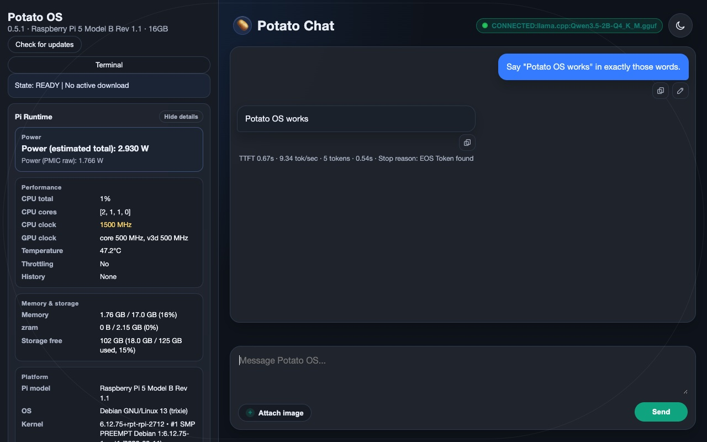
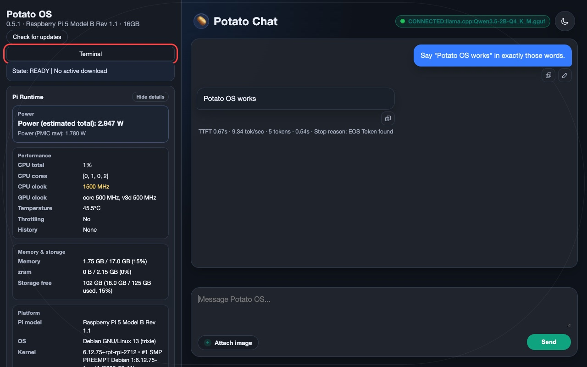
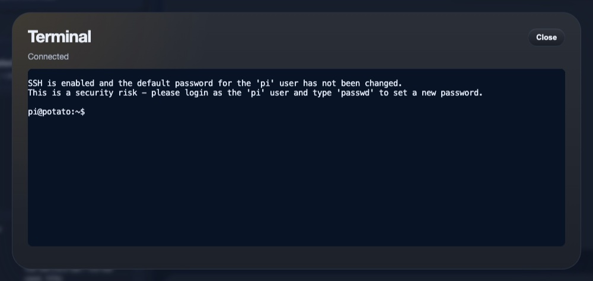
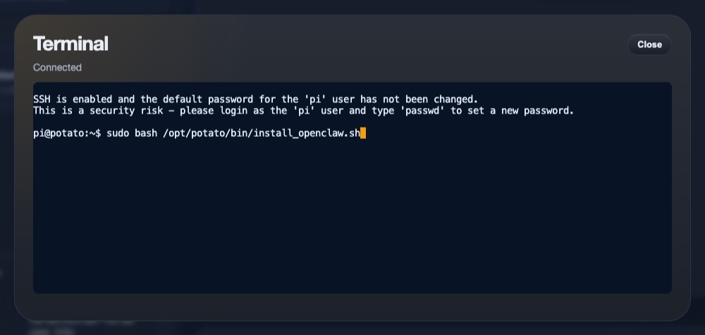
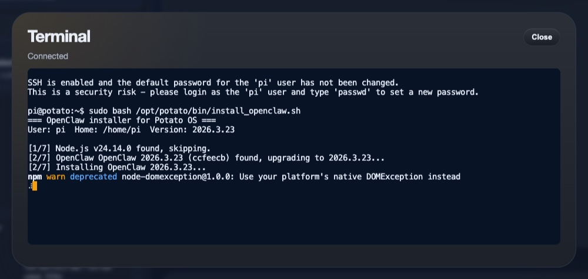
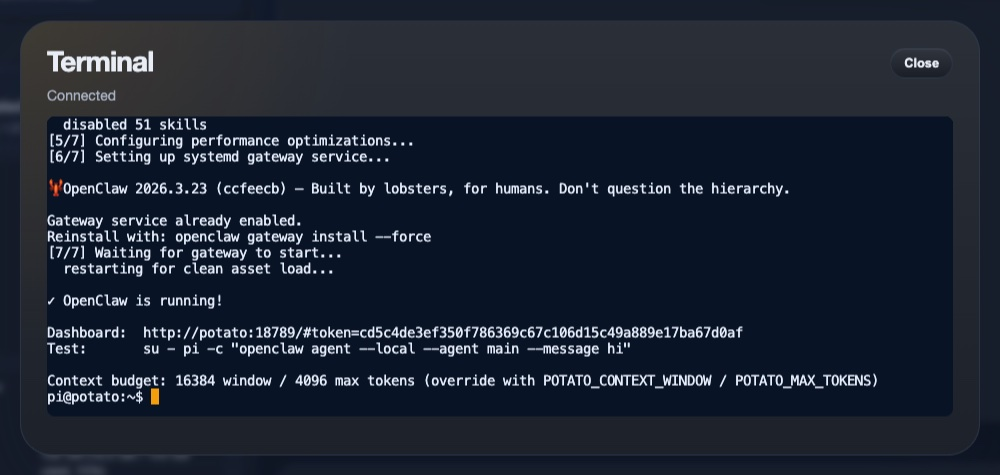
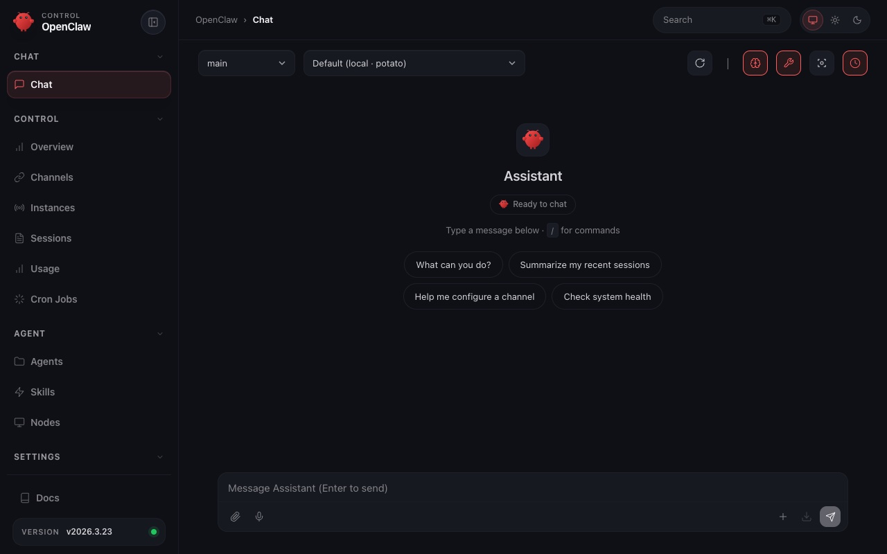
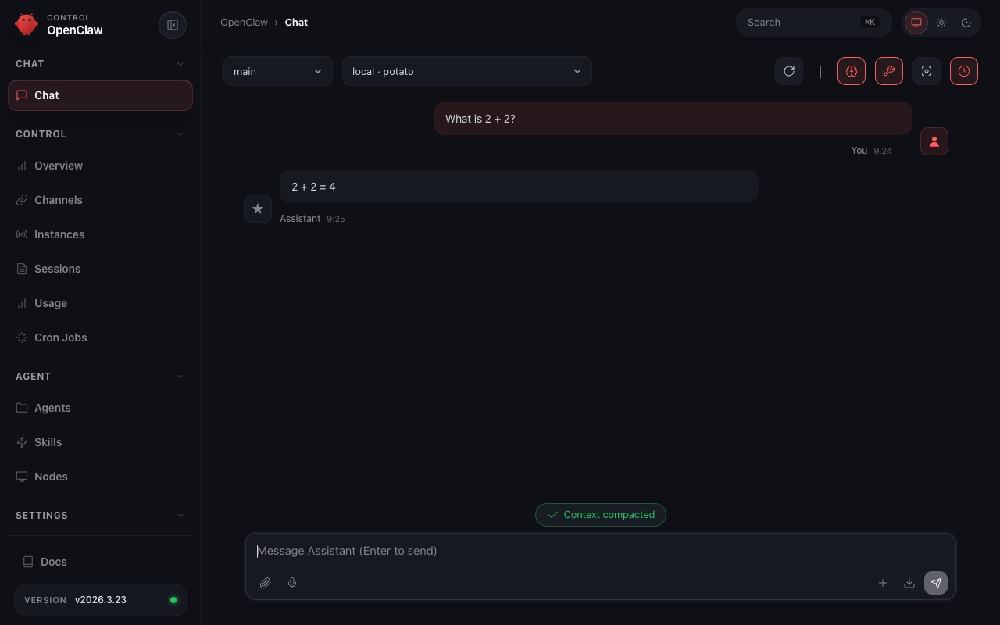

# Installing OpenClaw on Potato OS

OpenClaw is an open-source AI agent framework that turns your Potato OS into a local coding assistant. This guide walks you through the installation — it takes about 5 minutes.

## What you need

- Potato OS running on your Raspberry Pi 5 (`http://potato.local` loads in your browser)
- Internet connection on the Pi (for downloading packages)
- A browser on the same network

## Install OpenClaw

### 1. Open the Potato OS dashboard

Open `http://potato.local` in your browser. You should see the Potato OS interface with the sidebar on the left and the chat area on the right.



### 2. Open the terminal

Click the **Terminal** button in the sidebar (highlighted below). This opens a browser-based terminal connected to your Pi — no SSH needed.



### 3. Terminal ready

The terminal opens in a modal window. You should see a shell prompt (`pi@potato:~$`) and a **Connected** status at the top.



### 4. Run the installer

Copy and paste this command into the terminal and press **Enter**:

```
curl -fsSL https://raw.githubusercontent.com/slomin/potato-os/main/bin/install_openclaw.sh | sudo bash
```



### 5. Wait for installation

The installer runs through 7 phases: Node.js, OpenClaw, configuration, skills, performance tuning, systemd service, and verification. This takes about 5 minutes on a fresh install.



### 6. Installation complete

When finished, the installer prints **"OpenClaw is running!"** along with your dashboard URL. The URL includes an access token — copy it, you will need it in the next step.



### 7. Open the OpenClaw dashboard

Paste the dashboard URL into a new browser tab. The OpenClaw Control UI loads with the sidebar navigation on the left and the chat area in the center.



### 8. Start chatting

Type a message and press **Enter**. OpenClaw sends it to the local model running on your Pi and streams back a response. You now have a local AI coding assistant on your Raspberry Pi.



## Configuration

OpenClaw is pre-configured to work within your Pi's 16k token context window:

| Setting | Default | Override with |
|---------|---------|---------------|
| Context window | 16,384 tokens | `POTATO_CONTEXT_WINDOW` |
| Max output tokens | 4,096 tokens | `POTATO_MAX_TOKENS` |

To override defaults, set the environment variable before running the installer:

```bash
POTATO_CONTEXT_WINDOW=32768 curl -fsSL https://raw.githubusercontent.com/slomin/potato-os/main/bin/install_openclaw.sh | sudo bash
```

The configuration lives at `~/.openclaw/openclaw.json`. The gateway token (needed to access the dashboard) is stored there under `gateway.auth.token`.

## Uninstall

To remove OpenClaw completely:

```
curl -fsSL https://raw.githubusercontent.com/slomin/potato-os/main/bin/uninstall_openclaw.sh | sudo bash
```

This stops the gateway, removes the package, restores disabled skills, and cleans up configuration. Node.js is kept by default — set `REMOVE_NODEJS=1` to remove it too.

## Troubleshooting

**Dashboard doesn't load:**
- Check that the gateway is running: open the terminal and run `systemctl --user status openclaw-gateway`
- Restart it with `systemctl --user restart openclaw-gateway`

**Model not responding:**
- Make sure Potato OS is running and the model is loaded — check `http://potato.local` for a green **CONNECTED** status

**Lost your dashboard token:**
- Open the terminal and run: `grep token ~/.openclaw/openclaw.json`
- Or re-run the installer — it preserves your config and prints the URL again

**Need to start over:**
- Uninstall with the command above, then re-install
